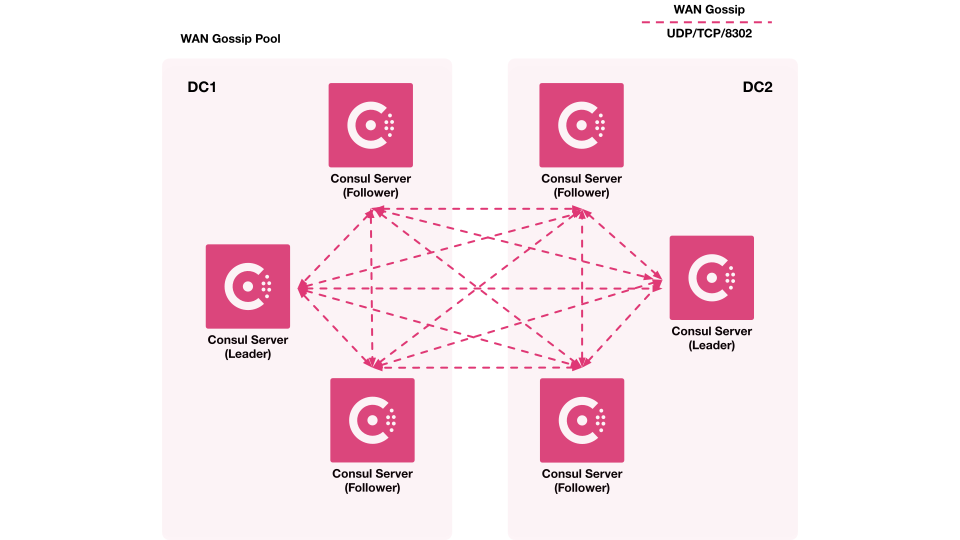

# Introducing a Service Mesh with Consul

This chapter transitions from the non-mesh microservices architecture to incorporating a service mesh, using HashiCorp Consul. It recaps the existing setup on Amazon ECS with Fargate, evaluates its strengths and limitations for scaling, and introduces service mesh concepts to address operational challenges. The discussion explores why service meshes become necessary as services grow, Consul's core components, and underlying protocols like Raft and Gossip. Configurations are variable-driven for flexibility, with a focus on communication efficiency and reduced manual overhead. The narrative builds toward implementing Consul, emphasizing its role in service discovery and traffic management.

## Recapping the Non-Mesh Architecture

The architecture developed so far includes a VPC, ECS cluster, public `client` service, and private backend services (`fruits` and `vegetables`) connected to an EC2-based database. All ECS services run on Fargate for serverless operation, with ALBs handling traffic—public for the `client` and internal for backends.


This setup provides a scalable foundation with fault tolerance, allowing independent service releases and scaling (e.g., more instances for high-traffic services like `fruits`). However, it suits smaller setups; for hundreds of services, the overhead of manual configurations (e.g., updating URIs) and duplicated code becomes burdensome.

### Evaluating the Setup for Scalability

Microservices enable specialized, language-agnostic services with independent maintenance and scaling. The current design works for two functional services but highlights trade-offs: while modular, adding services requires tweaking existing ones (e.g., `client` URIs), introducing error-prone workflows. As teams grow, large files complicate navigation, and understanding inter-service communication mentally strains developers. These issues motivate evaluating enhancements for larger-scale deployments, where per-service scaling (e.g., more `fruits` instances due to traffic) and reduced complexity are critical.

## Introducing Service Mesh

A service mesh manages communication between microservices, abstracting routing, security, and observability. It addresses the limitations of direct ALB-based connections by automating service discovery and traffic policies, reducing manual updates.

**What Actually Happens (Analogy):** Imagine three people—Jenna, Cole, and Blake—exchanging postcards by hand-delivering them. Each delivery varies: Jenna navigates different routes, mailboxes, or risks (e.g., postcard thieves) to reach Cole versus Blake. Adding more people (services) increases complexity, as everyone learns new delivery paths.

A service mesh is like hiring delivery people managed by a delivery manager: Jenna hands postcards to a delivery person, who handles routes and risks uniformly, delivering to Cole or Blake identically. The manager sets rules (e.g., lockboxes, back-door deliveries) centrally, simplifying communication.

In technical terms, services (people) use sidecar proxies (delivery people) and Consul servers (delivery manager) to standardize traffic, abstracting routing, security, and observability. This eliminates manual URI updates, reduces load balancers, and supports features like traffic splitting without code changes.


**What Actually Happens (Technical Terms):** Instead of services communicating directly (e.g., via hardcoded `UPSTREAM_URIS` like `http://${var.database_private_ip}:27017`), they use sidecar proxies (e.g., Envoy) managed by Consul agents. Traffic flows through these proxies, which handle routing, load balancing, and policies. Consul servers act as the delivery manager, maintaining a service catalog and enforcing rules (e.g., blocking connections, enforcing encryption).


This standardizes communication, enhances observability (e.g., monitoring proxy traffic for errors), and supports dynamic scaling. Proxies provide load balancing without dedicated ALBs, selecting healthy instances automatically, and service discovery ensures new services are known without manual updates, reducing operational overhead.

For this architecture, a mesh eliminates the need for explicit URIs in task definitions, allowing dynamic scaling without reconfiguration. It also cuts down on per-service load balancers, simplifying operations while maintaining resilience.

### Why Transition to a Service Mesh?

As services proliferate, operational overhead grows: each new backend requires updates to upstream services, creating ticket-based workflows prone to human error. A mesh centralizes these concerns, enabling services to discover and communicate automatically. It supports advanced features like traffic splitting or retries without code changes, making it suitable for production at scale. The decision aligns with starting simple (non-mesh for few services) and evolving as complexity increases, avoiding premature optimization.

## Core Components of Consul

Consul, HashiCorp's service mesh tool, consists of a single binary—the Consul agent—run in server or `client` mode. Servers (typically 3-5 for redundancy) form a cluster, while clients run alongside services. The agent handles registration, health checks, and configuration. Envoy, an open-source proxy, integrates with Consul agents to manage traffic but remains largely abstracted from operators, who interact primarily via the Consul CLI or API.


### Consul's Multi-Faceted Role

Consul serves as a service catalog (registering/discovering services), key-value store (for configurations), and service mesh (for traffic management). For this setup, the focus is the mesh aspect, but users may leverage others (e.g., KV for dynamic configs). This versatility means Consul adapts to needs, though it requires opening multiple ports for communication (e.g., for DNS, HTTP, gRPC).

## Underlying Protocols in Consul

Consul relies on two protocols for reliability and efficiency: [Raft](https://developer.hashicorp.com/consul/docs/concept/consensus) for consensus and [Gossip](https://developer.hashicorp.com/consul/docs/concept/gossip) for communication. These enable decentralized, fault-tolerant operations without single points of failure.

### Raft Consensus Protocol

Raft elects a leader among Consul servers, ensuring consistent state across the cluster. Followers replicate the leader's data; if the leader fails, Raft triggers a new election. This protocol underpins server reliability, handling transactions like service registrations. While not daily operational knowledge, understanding Raft aids in architecting resilient clusters, similar to container internals like cgroups.

### Gossip Protocol

Gossip spreads information among agents by randomly selecting pairs to sync, propagating updates efficiently without central coordination. This avoids bottlenecks (e.g., all agents querying servers) and supports cross-datacenter communication. The protocol's port-intensive nature (for UDP/TCP exchanges) requires careful firewall rules but enables rapid, scalable discovery—analogous to word-of-mouth in a crowd, ensuring all agents eventually align.

## Preparing for Consul Implementation

With the non-mesh setup complete, the next steps involve deploying Consul agents alongside services, configuring ports for Raft/Gossip, and integrating Envoy proxies. This will replace manual URIs with automated discovery, reducing overhead. Initial setups may use defaults, but scaling demands attention to server counts (odd numbers for quorum) and network rules.

### Ports and Configuration Considerations

Consul requires multiple ports (e.g., 8300-8302 for Gossip, 8500-8502 for HTTP/gRPC, 8600 for DNS). Configurations are file-based or CLI-driven, with agents joining clusters via bootstrap or join commands. For hybrid AWS setups (ECS/EC2), ensure VPC security groups allow these ports between components.



## Preparing for Consul Servers

This session continues the implementation of a service mesh with HashiCorp Consul, focusing on setting up Consul servers on EC2 instances. Think of Consul servers as the "brain" of the mesh, coordinating services and managing communication. The notes guide you through configuring these servers step-by-step, explaining why EC2 is used (for greater control), and how to ensure a secure, resilient setup with multiple instances. Key concepts like quorum (majority voting for reliable decisions) and communication ports are introduced clearly.

The approach reuses patterns from prior setups (e.g., AMI selection) while adding new elements like IAM roles for permissions and a load balancer for UI access. The configuration process uses a checklist-style approach to maintain clarity, with time-boxed sessions ensuring steady progress.

Before starting, ensure the existing setup is applied (`terraform apply`) to have the ECS cluster, `client`, `fruits`, `vegetables` services, and EC2 database running. This confirms the VPC, subnets, and NAT gateway are ready, as Consul servers rely on the NAT gateway for outbound internet access (e.g., to download packages). Check the AWS console under ECS &gt; Clusters to verify that services are active.

### Defining Local Variables for CIDR and IPs

Local variables compute subnet CIDR blocks and private IPs dynamically, reducing errors by avoiding hardcoded values.

```py
# File: locals.tf

locals {
  public_cidr_blocks  = [for i in range(
    var.public_subnet_count) : cidrsubnet(var.vpc_cidr_block, 4, i)]
  private_cidr_blocks = [for i in range(
    var.private_subnet_count) : cidrsubnet(var.vpc_cidr_block, 4, 
                                            i + var.public_subnet_count)]
  server_private_ips  = [for i in local.private_cidr_blocks : cidrhost(i, 250)]
}
```

**Why Use Locals?** Locals act like reusable shortcuts. They calculate subnet ranges from the VPC’s CIDR block and assign static IPs (ending in .250) for Consul servers. This ensures consistent addressing across subnets, making it easier to troubleshoot or configure services.

## Configuring Consul Server Variables

Variables make the Consul setup flexible, allowing adjustments without changing code.

```py
# File: variables.tf

variable "consul_server_count" {
  type        = number
  description = "The number of Consul Servers to create"
  default     = 3
}

variable "consul_server_allowed_cidr_blocks" {
  type        = list(string)
  description = <<EOT
List of valid IPv4 CIDR blocks that can access the consul servers 
from the public internet.
EOT
  default     = ["0.0.0.0/0"]
}

variable "consul_server_allowed_cidr_blocks_ipv6" {
  type        = list(string)
  description = <<EOT
List of valid IPv6 CIDR blocks that can access the consul servers 
from the public internet.
EOT
  default     = ["::/0"]
}
```

**Why These Variables?**

- **Consul server count**: Sets 3 servers by default to form a quorum, where a majority vote ensures reliable decisions (e.g., leader election) via the Raft protocol. Odd numbers prevent voting ties, unlike even numbers, while a single server lacks fault tolerance.
- **Allowed CIDR Blocks**: Defines which IPs can access the Consul UI/API (e.g., an admin’s IP). The default (`0.0.0.0/0`) allows all for simplicity but should be restricted in production for security. IPv6 support ensures compatibility.

## Setting Up Consul Servers on EC2

Consul servers run on EC2 instances in private subnets, forming the control plane that manages the service mesh. Using multiple instances ensures resilience through quorum.

### EC2 Instance Configuration

Create multiple instances using `count`, with configurations mirroring the database setup for consistency.

```py
# File: ec2.tf

resource "aws_instance" "consul_server" {
  count = var.consul_server_count

  ami                         = data.aws_ssm_parameter.ubuntu1804.value
  instance_type               = "t3.micro"
  subnet_id                   = aws_subnet.private[count.index].id
  associate_public_ip_address = false
  key_name                    = var.ec2_key_pair

  vpc_security_group_ids = [aws_security_group.consul_server.id]
  private_ip             = local.server_private_ips[count.index]

  iam_instance_profile = aws_iam_instance_profile.consul_instance_profile.name

  tags = { "Name" = "${var.default_tags.project}-consul-server" }

  user_data = base64encode(templatefile("${path.module}/scripts/server.sh", {
    // TODO - episode 5
  }))

  depends_on = [aws_nat_gateway.nat]
}
```

**Step-by-Step Explanation:**

- **count**: Creates 3 instances (from `consul_server_count`), distributing them across private subnets using `count.index` (0,1,2) for high availability.
- **AMI and Instance Type**: Uses the same Ubuntu 18.04 AMI (from SSM Parameter Store) as the database for consistency; `t3.micro` is cost-effective for small workloads.
- **Private Subnet and No Public IP**: Places servers in private subnets, blocking internet access for security; SSH via key pair or bastion for debugging.
- **Security Group and Private IP**: Applies a custom security group (below) for Consul ports; static IPs from `local.server_private_ips` ensure consistent addressing.
- **IAM Profile**: Grants permissions (e.g., to describe instances) for Consul operations.
- **User Data**: A placeholder script (`server.sh`) will install Consul (covered later); base64 encoding prepares it for AWS.
- **Depends On**: Ensures the NAT gateway is ready for internet access (e.g., downloading Consul).

**Why EC2 for Servers?** EC2 provides direct control over the OS and persistent storage, suitable for Consul servers that maintain Raft state, unlike Fargate’s serverless abstraction used for services.

## IAM Role for Consul Instances

An IAM role grants EC2 instances secure access to AWS services without storing credentials.

```py
# File: iam.tf

resource "aws_iam_role" "consul_instance" {
  name_prefix        = "${var.default_tags.project}-role-"
  assume_role_policy = data.aws_iam_policy_document.instance_trust_policy.json
}

data "aws_iam_policy_document" "instance_trust_policy" {
  statement {
    effect = "Allow"
    principals {
      type        = "Service"
      identifiers = ["ec2.amazonaws.com"]
    }
    actions = ["sts:AssumeRole"]
  }
}

data "aws_iam_policy_document" "instance_permissions_policy" {
  statement {
    sid    = "DescribeInstances"
    effect = "Allow"
    actions = ["ec2:DescribeInstances"]
    resources = ["*"]
  }
}

resource "aws_iam_role_policy" "consul_instance_policy" {
  name_prefix = "${var.default_tags.project}-instance-policy-"
  role        = aws_iam_role.consul_instance.id
  policy      = data.aws_iam_policy_document.instance_permissions_policy.json
}

resource "aws_iam_instance_profile" "consul_instance_profile" {
  name_prefix = "${var.default_tags.project}-instance-profile-"
  role        = aws_iam_role.consul_instance.name
}
```

**Why Use IAM Roles?** Think of roles as permission passes: the trust policy lets EC2 instances assume the role, while the permissions policy allows actions like `ec2:DescribeInstances` for Consul to discover instances. The profile links the role to EC2, ensuring secure, credential-free access.

## Securing Consul Servers

A security group controls traffic to Consul servers, opening specific ports for communication.

```py
# File: security-groups.tf

resource "aws_security_group" "consul_server" {
  name_prefix = "${var.default_tags.project}-consul-server"
  description = "Security Group for the Consul servers"
  vpc_id      = aws_vpc.main.id
}

resource "aws_security_group_rule" "consul_server_allow_server_8300" {
  security_group_id = aws_security_group.consul_server.id
  type              = "ingress"
  protocol          = "tcp"
  from_port         = 8300
  to_port           = 8300
  self              = true
  description       = <<EOT
Allow RPC traffic from ConsulServer to Server. 
For data replication between servers.
EOT
}

resource "aws_security_group_rule" "consul_server_allow_server_8301" {
  security_group_id = aws_security_group.consul_server.id
  type              = "ingress"
  protocol          = "tcp"
  from_port         = 8301
  to_port           = 8301
  self              = true
  description       = <<EOT
Allow LAN gossip traffic from ConsulServer to Server. 
For managing cluster membership, distributed health checks of agents 
and event broadcasts
EOT
}

resource "aws_security_group_rule" "consul_server_allow_server_8302" {
  security_group_id = aws_security_group.consul_server.id
  type              = "ingress"
  protocol          = "tcp"
  from_port         = 8302
  to_port           = 8302
  self              = true
  description       = <<EOT
Allow WAN gossip traffic from ConsulServer to Server.
For cross-datacenter communication
EOT
}

resource "aws_security_group_rule" "consul_server_allow_alb_8500" {
  security_group_id        = aws_security_group.consul_server.id
  type                     = "ingress"
  protocol                 = "tcp"
  from_port                = 8500
  to_port                  = 8500
  source_security_group_id = aws_security_group.consul_server_alb.id
  description       = <<EOT
Allow HTTP traffic from Load Balancer onto the Consul Server API.
EOT
}

resource "aws_security_group_rule" "consul_server_allow_outbound" {
  security_group_id = aws_security_group.consul_server.id
  type              = "egress"
  protocol          = "-1"
  from_port         = 0
  to_port           = 0
  cidr_blocks       = ["0.0.0.0/0"]
  description       = "Allow outbound traffic"
}
```

**Why These Rules?** Security groups act like door locks, controlling who enters. Rules allow servers to communicate internally:

- port 8300 for Raft replication,
- port 8301 for Gossip (cluster management),
- port 8302 for cross-datacenter Gossip.
- port 8500 allows the ALB to access the Consul API/UI.

`self = true` limits traffic to servers in the same group, while outbound permits updates or external calls.

## Load Balancer for Consul UI/API

An Application Load Balancer (ALB) exposes the Consul UI and API on port 8500 for admin access.

```py
# File: ecs-loadbalancers.tf

resource "aws_lb" "consul_server_alb" {
  name_prefix        = "cs-"
  load_balancer_type = "application"
  security_groups    = [aws_security_group.consul_server_alb.id]
  subnets            = aws_subnet.public.*.id
  idle_timeout       = 60
  ip_address_type    = "dualstack"

  tags = { "Name" = "${var.default_tags.project}-consul-server-alb" }
}

resource "aws_lb_target_group" "consul_server_alb_targets" {
  name_prefix          = "cs-"
  port                 = 8500
  protocol             = "HTTP"
  vpc_id               = aws_vpc.main.id
  deregistration_delay = 30
  target_type          = "instance"

  health_check {
    enabled             = true
    path                = "/v1/status/leader"
    healthy_threshold   = 3
    unhealthy_threshold = 3
    timeout             = 30
    interval            = 60
    protocol            = "HTTP"
  }

  tags = { "Name" = "${var.default_tags.project}-consul-server-tg" }
}

resource "aws_lb_target_group_attachment" "consul_server" {
  count            = var.consul_server_count
  target_group_arn = aws_lb_target_group.consul_server_alb_targets.arn
  target_id        = aws_instance.consul_server[count.index].id
  port             = 8500
}

resource "aws_lb_listener" "consul_server_alb_http_80" {
  load_balancer_arn = aws_lb.consul_server_alb.arn
  port              = 80
  protocol          = "HTTP"

  default_action {
    type             = "forward"
    target_group_arn = aws_lb_target_group.consul_server_alb_targets.arn
  }
}
```

**Why Use an ALB?** The ALB directs traffic to Consul servers, like a receptionist routing visitors. Placed in public subnets, it allows admin access to the UI/API. The health check (`/v1/status/leader`) ensures a leader exists. `target_type = "instance"` links EC2 instances, and the listener forwards port 80 to 8500.

## ALB Security Group

Restricts ALB access to specific IPs and the VPC.

```py
# File: security-groups.tf

resource "aws_security_group" "consul_server_alb" {
  name_prefix = "${var.default_tags.project}-consul-server-alb"
  description = "Security Group for the ALB fronting the consul server"
  vpc_id      = aws_vpc.main.id
}

resource "aws_security_group_rule" "consul_server_alb_allow_80" {
  security_group_id = aws_security_group.consul_server_alb.id
  type              = "ingress"
  protocol          = "tcp"
  from_port         = 80
  to_port           = 80
  cidr_blocks       = flatten([var.consul_server_allowed_cidr_blocks, 
                                [var.vpc_cidr_block]])
  description       = "Allow HTTP traffic."
}

resource "aws_security_group_rule" "consul_server_alb_allow_outbound" {
  security_group_id = aws_security_group.consul_server_alb.id
  type              = "egress"
  protocol          = "-1"
  from_port         = 0
  to_port           = 0
  cidr_blocks       = ["0.0.0.0/0"]
  ipv6_cidr_blocks  = ["::/0"]
  description       = "Allow any outbound traffic."
}
```

**Why Restrict Access?** The `flatten` function combines user-specified IPs (e.g., your admin IP) with the VPC’s CIDR, allowing external admin access and internal traffic (e.g., from services). Outbound rules enable forwarding to servers, ensuring the ALB can communicate.

## Updating Subnets for CIDR Blocks

Subnets use calculated CIDR blocks from locals to avoid overlaps.

```py
# File: vpc.tf (excerpt)

resource "aws_subnet" "public" {
  # ... (other config)
  cidr_block = local.public_cidr_blocks[count.index]
}

resource "aws_subnet" "private" {
  # ... (other config)
  cidr_block = local.private_cidr_blocks[count.index]
}
```

**Why Update Subnets?** This ensures subnets align with calculated ranges, supporting static IPs for Consul servers and maintaining network organization.

### Future Steps: Completing the Setup

The user data script (`server.sh`) to install Consul is planned for the next session, as it configures the servers to join the cluster. The current configuration serves as a checklist: complete IAM roles, security groups, and load balancers before applying. The `depends_on` ensures the NAT gateway is ready, avoiding setup failures.

### Benefits of the Service Mesh

The setup requires upfront effort, like building a factory for one book versus thousands. Consul servers reduce load balancers, automate service discovery, and standardize communication, simplifying scaling as services grow. This addresses the manual URI updates and error-prone workflows of the non-mesh setup.
