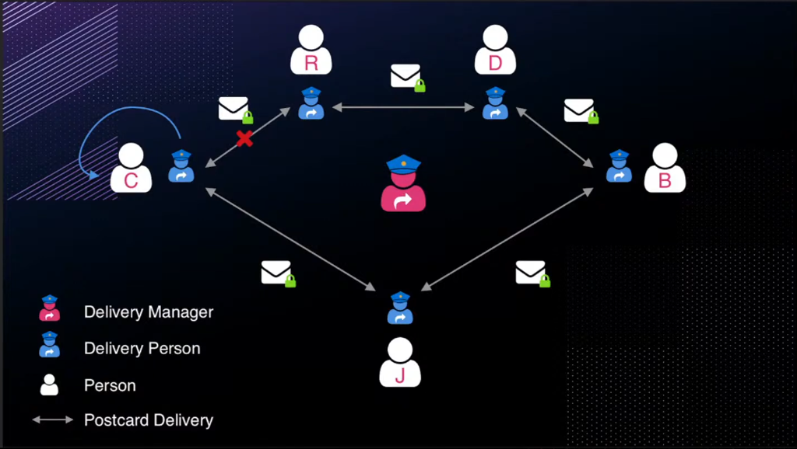
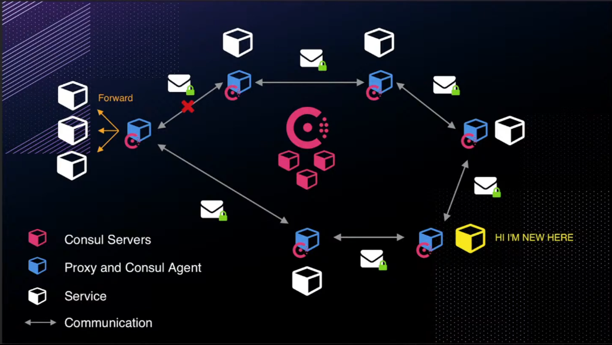
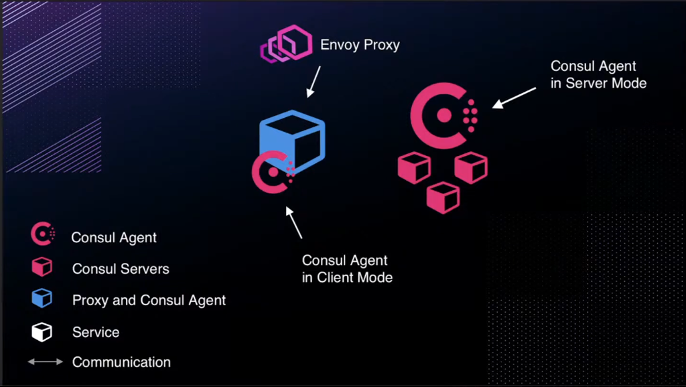

# Introducing a Service Mesh with Consul

This chapter transitions from the non-mesh microservices architecture to incorporating a service mesh, using HashiCorp Consul. It recaps the existing setup on Amazon ECS with Fargate, evaluates its strengths and limitations for scaling, and introduces service mesh concepts to address operational challenges. The discussion explores why service meshes become necessary as services grow, Consul's core components, and underlying protocols like Raft and Gossip. Configurations are variable-driven for flexibility, with a focus on communication efficiency and reduced manual overhead. The narrative builds toward implementing Consul, emphasizing its role in service discovery and traffic management.

## Recapping the Non-Mesh Architecture

The architecture developed so far includes a VPC, ECS cluster, public client service, and private backend services (fruits and vegetables) connected to an EC2-based database. All ECS services run on Fargate for serverless operation, with ALBs handling traffic—public for the client and internal for backends.

This setup provides a scalable foundation with fault tolerance, allowing independent service releases and scaling (e.g., more instances for high-traffic services like fruits). However, it suits smaller setups; for hundreds of services, the overhead of manual configurations (e.g., updating URIs) and duplicated code becomes burdensome.

### Evaluating the Setup for Scalability

Microservices enable specialized, language-agnostic services with independent maintenance and scaling. The current design works for two functional services but highlights trade-offs: while modular, adding services requires tweaking existing ones (e.g., client URIs), introducing error-prone workflows. As teams grow, large files complicate navigation, and understanding inter-service communication mentally strains developers. These issues motivate evaluating enhancements for larger-scale deployments, where per-service scaling (e.g., more fruits instances due to traffic) and reduced complexity are critical.

## Introducing Service Mesh

A service mesh manages communication between microservices, abstracting routing, security, and observability. It addresses the limitations of direct ALB-based connections by automating service discovery and traffic policies, reducing manual updates.

**What Actually Happens (Analogy):** Imagine three people—Jenna, Cole, and Blake—exchanging postcards by hand-delivering them. Each delivery varies: Jenna navigates different routes, mailboxes, or risks (e.g., postcard thieves) to reach Cole versus Blake. Adding more people (services) increases complexity, as everyone learns new delivery paths. A service mesh is like hiring delivery people managed by a delivery manager: Jenna hands postcards to a delivery person, who handles routes and risks uniformly, delivering to Cole or Blake identically. The manager sets rules (e.g., lockboxes, back-door deliveries) centrally, simplifying communication. In technical terms, services (people) use sidecar proxies (delivery people) and Consul servers (delivery manager) to standardize traffic, abstracting routing, security, and observability. This eliminates manual URI updates, reduces load balancers, and supports features like traffic splitting without code changes.

**What Actually Happens (Technical Terms):** Instead of services communicating directly (e.g., via hardcoded `UPSTREAM_URIS` like `http://${var.database_private_ip}:27017`), they use sidecar proxies (e.g., Envoy) managed by Consul agents. Traffic flows through these proxies, which handle routing, load balancing, and policies. Consul servers act as the delivery manager, maintaining a service catalog and enforcing rules (e.g., blocking connections, enforcing encryption).

This standardizes communication, enhances observability (e.g., monitoring proxy traffic for errors), and supports dynamic scaling. Proxies provide load balancing without dedicated ALBs, selecting healthy instances automatically, and service discovery ensures new services are known without manual updates, reducing operational overhead.

For this architecture, a mesh eliminates the need for explicit URIs in task definitions, allowing dynamic scaling without reconfiguration. It also cuts down on per-service load balancers, simplifying operations while maintaining resilience.

### Why Transition to a Service Mesh?

As services proliferate, operational overhead grows: each new backend requires updates to upstream services, creating ticket-based workflows prone to human error. A mesh centralizes these concerns, enabling services to discover and communicate automatically. It supports advanced features like traffic splitting or retries without code changes, making it suitable for production at scale. The decision aligns with starting simple (non-mesh for few services) and evolving as complexity increases, avoiding premature optimization.

## Core Components of Consul

Consul, HashiCorp's service mesh tool, consists of a single binary—the Consul agent—run in server or client mode. Servers (typically 3-5 for redundancy) form a cluster, while clients run alongside services. The agent handles registration, health checks, and configuration. Envoy, an open-source proxy, integrates with Consul agents to manage traffic but remains largely abstracted from operators, who interact primarily via the Consul CLI or API.

### Consul's Multi-Faceted Role

Consul serves as a service catalog (registering/discovering services), key-value store (for configurations), and service mesh (for traffic management). For this setup, the focus is the mesh aspect, but users may leverage others (e.g., KV for dynamic configs). This versatility means Consul adapts to needs, though it requires opening multiple ports for communication (e.g., for DNS, HTTP, gRPC).

## Underlying Protocols in Consul

Consul relies on two protocols for reliability and efficiency: [Raft](https://developer.hashicorp.com/consul/docs/concept/consensus) for consensus and [Gossip](https://developer.hashicorp.com/consul/docs/concept/gossip) for communication. These enable decentralized, fault-tolerant operations without single points of failure.

### Raft Consensus Protocol

Raft elects a leader among Consul servers, ensuring consistent state across the cluster. Followers replicate the leader's data; if the leader fails, Raft triggers a new election. This protocol underpins server reliability, handling transactions like service registrations. While not daily operational knowledge, understanding Raft aids in architecting resilient clusters, similar to container internals like cgroups.

### Gossip Protocol

Gossip spreads information among agents by randomly selecting pairs to sync, propagating updates efficiently without central coordination. This avoids bottlenecks (e.g., all agents querying servers) and supports cross-datacenter communication. The protocol's port-intensive nature (for UDP/TCP exchanges) requires careful firewall rules but enables rapid, scalable discovery—analogous to word-of-mouth in a crowd, ensuring all agents eventually align.

## Preparing for Consul Implementation

With the non-mesh setup complete, the next steps involve deploying Consul agents alongside services, configuring ports for Raft/Gossip, and integrating Envoy proxies. This will replace manual URIs with automated discovery, reducing overhead. Initial setups may use defaults, but scaling demands attention to server counts (odd numbers for quorum) and network rules.

### Ports and Configuration Considerations

Consul requires multiple ports (e.g., 8300-8302 for Gossip, 8500-8502 for HTTP/gRPC, 8600 for DNS). Configurations are file-based or CLI-driven, with agents joining clusters via bootstrap or join commands. For hybrid AWS setups (ECS/EC2), ensure VPC security groups allow these ports between components.
