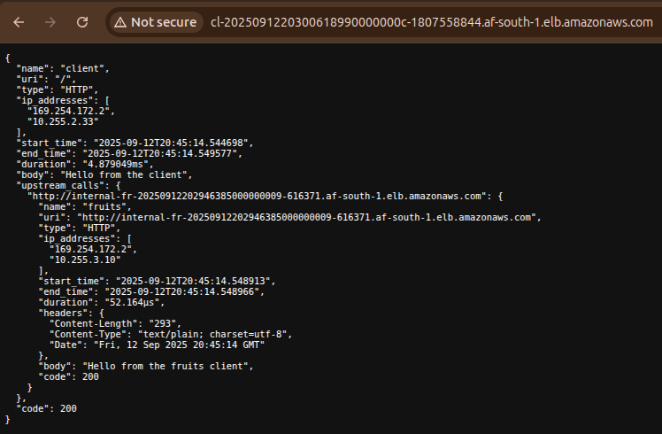
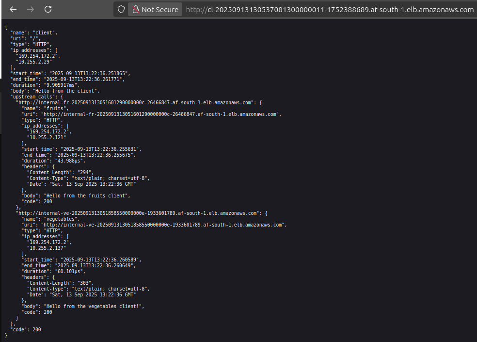
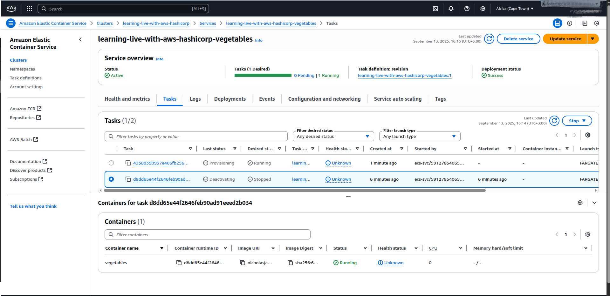
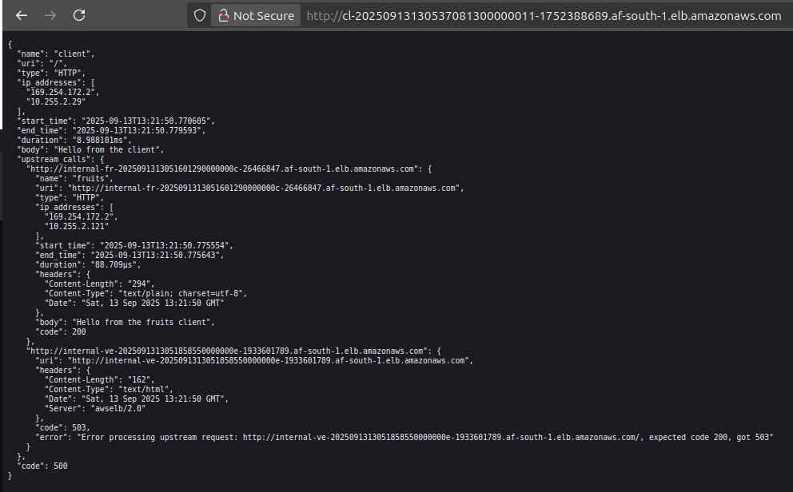

# Extending Your Application with Private Microservices

The first part of episode 3 the focuses on extending the microservices architecture by adding a private `fruits` service to the existing setup, which already includes a public `client` service running on Amazon ECS with Fargate. The emphasis is on creating private services accessible only within the VPC, integrating them with the `client` service, and setting the stage for future service mesh adoption. The notes explain the configuration of ECS task definitions, services, load balancers, and security groups, detailing why private services differ from public ones, how to manage internal traffic, and the importance of Terraform state management. The approach builds from the `client` service, reusing patterns to minimize redundancy while introducing new concepts like internal load balancers and environment variable configurations for service communication.

## Recap of the Existing Architecture

The architecture so far includes a Virtual Private Cloud (VPC) with public and private subnets, an ECS cluster, and a public `client` service. The `client` service, hosted in private subnets for security, is exposed via an Application Load Balancer (ALB) in public subnets, accessible over HTTP on port 80. The setup uses Fargate for serverless container execution, with task definitions specifying container details and security groups controlling traffic. The goal is to add a private `fruits` service that the `client` can call internally, simulating a backend microservice (e.g., for fruit-related data) while remaining inaccessible externally.

### Why Add a Private Service?

Microservices architectures split functionality into specialized services. The `client` service acts as a user-facing entry point, while backend services like `fruits` handle specific tasks (e.g., data retrieval). Private services enhance security by restricting access to internal components, reducing attack surfaces. This chapter replicates the client service pattern for the `fruits` service, adjusting for internal access and connectivity.

## Configuring the Fruits Service

The `fruits` service mirrors the `client` service but is private, meaning its ALB resides in private subnets and is only accessible within the VPC. The setup involves an ECS task definition, service, load balancer, and security groups, all defined in Terraform.

### ECS Task Definition for Fruits

The task definition outlines the container for the `fruits` service, using the same fake-service image as the `client` for consistency. It specifies Fargate compatibility, modest resource allocations (256 CPU units, 512 MB memory), and `awsvpc` networking for VPC integration. The container listens on port 9090, with environment variables setting its identity and response.

```py
# File: ecs-task-definition.tf

resource "aws_ecs_task_definition" "fruits" {
  family                   = "${var.default_tags.project}-fruits"
  requires_compatibilities = ["FARGATE"]
  memory                   = 512
  cpu                      = 256
  network_mode             = "awsvpc"

  container_definitions = jsonencode([
    {
      name      = "fruits"
      image     = "nicholasjackson/fake-service:v0.23.1"
      cpu       = 0
      essential = true
      portMappings = [
        {
          containerPort = 9090
          hostPort      = 9090
          protocol      = "tcp"
        }
      ]
      environment = [
        {
          name  = "NAME"
          value = "fruits"
        },
        {
          name  = "MESSAGE"
          value = "Hello from the fruits client"
        }
      ]
    }
  ])
}
```

**Why These Settings?**

- **CPU=0**: Allows flexible resource sharing, as in the `client` service, since only one container runs per task.
- **Port 9090**: Matches the fake-service’s default listener, consistent with the `client`.
- **Environment Variables**: Set `NAME` and `MESSAGE` to customize the service’s response, simulating a fruit-specific API without code changes.
- **Omitted Upstream URIs**: Unlike the client, the `fruits` service doesn’t call other services yet, keeping it simple.

### Updating the `client` Task Definition

To enable the `client` to call the `fruits` service, add an `UPSTREAM_URIS` environment variable pointing to the `fruits` ALB’s DNS name. This requires updating the client’s task definition, which triggers a task replacement during `terraform apply`.

```py
# File: ecs-task-definition.tf

resource "aws_ecs_task_definition" "client" {
  family                   = "${var.default_tags.project}-client"
  requires_compatibilities = ["FARGATE"]
  memory                   = 512
  cpu                      = 256
  network_mode             = "awsvpc"

  container_definitions = jsonencode([
    {
      name      = "client"
      image     = "nicholasjackson/fake-service:v0.23.1"
      cpu       = 0
      essential = true
      portMappings = [
        {
          containerPort = 9090
          hostPort      = 9090
          protocol      = "tcp"
        }
      ]
      environment = [
        {
          name  = "NAME"
          value = "client"
        },
        {
          name  = "MESSAGE"
          value = "Hello from the client"
        },
        {
          # added part for upstream
          name  = "UPSTREAM_URIS"
          value = "http://${aws_lb.fruits_alb.dns_name}"
        }
      ]
    }
  ])
}
```

**Why Update the Client?**
The `UPSTREAM_URIS` variable tells the fake-service container to forward requests to the `fruits` service’s ALB, enabling internal communication. The DNS reference (`aws_lb.fruits_alb.dns_name`) dynamically resolves to the `fruits` ALB, avoiding hardcoding. This update causes Terraform to replace the `client` task to apply the new configuration, demonstrating state management’s role in tracking changes.

### ECS Service for Fruits

The `fruits` service runs the task definition, maintaining one instance in private subnets for security. It integrates with an internal ALB for traffic routing within the VPC.

```py
# File: ecs-services.tf

resource "aws_ecs_service" "fruits" {
  name            = "${var.default_tags.project}-fruits"
  cluster         = aws_ecs_cluster.main.arn
  task_definition = aws_ecs_task_definition.fruits.arn
  desired_count   = 1
  launch_type     = "FARGATE"

  load_balancer {
    target_group_arn = aws_lb_target_group.fruits_alb_targets.arn
    container_name   = "fruits"
    container_port   = 9090
  }

  network_configuration {
    subnets          = aws_subnet.private.*.id
    assign_public_ip = false
    security_groups  = [aws_security_group.ecs_fruits_service.id]
  }
}
```

**Why Private Subnets?**
Placing the service in private subnets ensures no public access, relying on the ALB for routing. `assign_public_ip = false` prevents external exposure, and the custom security group (defined below) restricts traffic to authorized sources.

## Configuring the Internal Load Balancer

The `fruits` service uses an internal ALB in private subnets, unlike the client’s public ALB. This restricts access to within the VPC, ideal for backend services.

### Fruits ALB Configuration

The ALB is marked `internal = true`, placed in private subnets, and linked to a dedicated security group.

```py
# File: ecs-loadbalancers.tf

resource "aws_lb" "fruits_alb" {
  name_prefix        = "fr-"
  load_balancer_type = "application"
  security_groups    = [aws_security_group.fruits_alb.id]
  subnets            = aws_subnet.private.*.id
  idle_timeout       = 60
  internal           = true

  tags = { "Name" = "${var.default_tags.project}-fruits-alb" }
}
```

**Why Internal?**
The `internal = true` setting ensures the ALB’s DNS is only resolvable within the VPC, preventing external access attempts (e.g., via browser, which should hang). This is critical for backend services handling sensitive operations.

### Target Group and Listener

The target group registers Fargate tasks by IP, with health checks to ensure only healthy tasks receive traffic. The listener forwards HTTP traffic on port 80 to the target group.

```py
# File: ecs-loadbalancers.tf

resource "aws_lb_target_group" "fruits_alb_targets" {
  name_prefix          = "fr-"
  port                 = 9090
  protocol             = "HTTP"
  vpc_id               = aws_vpc.main.id
  deregistration_delay = 30
  target_type          = "ip"

  health_check {
    enabled             = true
    path                = "/"
    healthy_threshold   = 3
    unhealthy_threshold = 3
    timeout             = 30
    interval            = 60
    protocol            = "HTTP"
  }

  tags = { "Name" = "${var.default_tags.project}-fruits-tg" }
}

resource "aws_lb_listener" "fruits_alb_http_80" {
  load_balancer_arn = aws_lb.fruits_alb.arn
  port              = 80
  protocol          = "HTTP"

  default_action {
    type             = "forward"
    target_group_arn = aws_lb_target_group.fruits_alb_targets.arn
  }
}
```

**Why These Settings?**

- **Target Type IP**: Fargate assigns unique IPs to tasks, unlike EC2’s instance-based targeting.
- **Health Checks**: Ensure tasks are responsive at "/", with balanced thresholds to avoid flapping.
- **Port 80**: Standard for HTTP, forwarding to the container’s 9090 port via the target group.

## Securing the Fruits Service

Security groups enforce least-privilege access, allowing only necessary traffic to the ALB and ECS service.

### Fruits ALB Security Group

Allow inbound HTTP from the `client` service’s security group (not public internet) and unrestricted outbound.

```py
# File: security-groups.tf

resource "aws_security_group" "fruits_alb" {
  name_prefix = "${var.default_tags.project}-ecs-fruits-alb"
  description = "security group for fruits service application load balancer"
  vpc_id      = aws_vpc.main.id
}

resource "aws_security_group_rule" "fruits_alb_allow_80" {
  security_group_id        = aws_security_group.fruits_alb.id
  type                     = "ingress"
  protocol                 = "tcp"
  from_port                = 80
  to_port                 = 80
  source_security_group_id = aws_security_group.ecs_client_service.id
  description              = "Allow HTTP traffic."
}

resource "aws_security_group_rule" "fruits_alb_allow_outbound" {
  security_group_id = aws_security_group.fruits_alb.id
  type              = "egress"
  protocol          = "-1"
  from_port         = 0
  to_port           = 0
  cidr_blocks       = ["0.0.0.0/0"]
  ipv6_cidr_blocks  = ["::/0"]
  description       = "Allow any outbound traffic."
}
```

**Why Restrict to Client Service?**
Using `source_security_group_id` ensures only the `client` service’s tasks can reach the `fruits` ALB, preventing unauthorized VPC access.

### Fruits ECS Service Security Group

Allow inbound from the `fruits` ALB on port 9090, self-referential traffic for potential multi-task setups, and unrestricted outbound.

```py
# File: security-groups.tf

resource "aws_security_group" "ecs_fruits_service" {
  name_prefix = "${var.default_tags.project}-ecs-fruits-service"
  description = "ECS Fruits service security group."
  vpc_id      = aws_vpc.main.id
}

resource "aws_security_group_rule" "ecs_fruits_service_allow_9090" {
  security_group_id        = aws_security_group.ecs_fruits_service.id
  type                     = "ingress"
  protocol                 = "tcp"
  from_port                = 9090
  to_port                  = 9090
  source_security_group_id = aws_security_group.fruits_alb.id
  description = "Allow incoming traffic from the fruits ALB into the service container port."
}

resource "aws_security_group_rule" "ecs_fruits_service_allow_inbound_self" {
  security_group_id = aws_security_group.ecs_fruits_service.id
  type              = "ingress"
  protocol          = -1
  self              = true
  from_port         = 0
  to_port           = 0
  description       = "Allow traffic from resources with this security group."
}

resource "aws_security_group_rule" "ecs_fruits_service_allow_outbound" {
  security_group_id = aws_security_group.ecs_fruits_service.id
  type              = "egress"
  protocol          = "-1"
  from_port         = 0
  to_port           = 0
  cidr_blocks       = ["0.0.0.0/0"]
  ipv6_cidr_blocks  = ["::/0"]
  description       = "Allow any outbound traffic."
}
```

**Why Self-Referential Rule?**
The `self = true` rule supports future multi-container tasks within the same service communicating internally, though not used here with a single task.

## Testing and Validating the Setup

After applying with `terraform apply`, the `client` service’s ALB DNS (from `outputs.tf`) should return a response including the `fruits` service’s message ("Hello from the `fruits` client") as shown below. The `fruits` ALB’s DNS, being internal, should be unreachable externally, confirming security settings.



**Note:** If issues arise (e.g., tasks draining), check the ECS console for task statuses, ensuring new tasks with updated environment variables are active.

### Why Task Replacement Happens

Updating the client task definition (adding `UPSTREAM_URIS`) triggers a service redeployment. Terraform’s state file tracks this change, replacing the old task with a new one, which may cause brief delays as tasks drain and restart.

## Adding the Vegetables Service

Building on the private `fruits` service, the next step is to introduce a `vegetables` microservice. This service follows the same architectural and security patterns, ensuring it is only accessible within the VPC and callable by the `client` service. The process involves defining a new ECS task, service, internal load balancer, target group, and security groups in Terraform.

### ECS Task Definition for Vegetables

The `vegetables` task definition is nearly identical to `fruits`, using the same container image and resource settings. The main differences are the environment variables, which identify the service as `vegetables`.

```py
# File: ecs-task-definition.tf

resource "aws_ecs_task_definition" "vegetables" {
  family                   = "${var.default_tags.project}-vegetables"
  requires_compatibilities = ["FARGATE"]
  memory                   = 512
  cpu                      = 256
  network_mode             = "awsvpc"

  container_definitions = jsonencode([
    {
      name      = "vegetables"
      image     = "nicholasjackson/fake-service:v0.23.1"
      cpu       = 0
      essential = true
      portMappings = [
        {
          containerPort = 9090
          hostPort      = 9090
          protocol      = "tcp"
        }
      ]
      environment = [
        {
          name  = "NAME"
          value = "vegetables"
        },
        {
          name  = "MESSAGE"
          value = "Hello from the vegetables service"
        }
      ]
    }
  ])
}
```

**Why Mirror the Fruits Service?**
Consistency in configuration simplifies management and troubleshooting, while unique environment variables distinguish the service’s identity and response.

### Updating the Client Task Definition for Vegetables

To enable the `client` to call both `fruits` and `vegetables`, update the `UPSTREAM_URIS` environment variable to include both internal ALB DNS names, separated by a comma.

```py
# File: ecs-task-definition.tf

resource "aws_ecs_task_definition" "client" {
  # ... other settings unchanged ...
  container_definitions = jsonencode([
    {
      # ... other container settings ...
      environment = [
        # ... other environment variables ...
        {
          name  = "UPSTREAM_URIS"
          # May not work with terraform apply this way. 
          # Used multi-line here only for readability purposes. 
          # Actual code in the repo.
          value = """http://${aws_lb.fruits_alb.dns_name},
                  http://${aws_lb.vegetables_alb.dns_name}"""
        }
      ]
    }
  ])
}
```

**Why Multiple Upstreams?**
This allows the `client` service to forward requests to both backend services, simulating a more realistic microservices environment.

### ECS Service for Vegetables

The ECS service for `vegetables` ensures the task runs in private subnets and is registered with its internal ALB.

```py
# File: ecs-services.tf

resource "aws_ecs_service" "vegetables" {
  name            = "${var.default_tags.project}-vegetables"
  cluster         = aws_ecs_cluster.main.arn
  task_definition = aws_ecs_task_definition.vegetables.arn
  desired_count   = 1
  launch_type     = "FARGATE"

  load_balancer {
    target_group_arn = aws_lb_target_group.vegetables_alb_targets.arn
    container_name   = "vegetables"
    container_port   = 9090
  }

  network_configuration {
    subnets          = aws_subnet.private.*.id
    assign_public_ip = false
    security_groups  = [aws_security_group.ecs_vegetables_service.id]
  }
}
```

**Why Use a Separate Service?**
Each backend microservice is managed independently, allowing for isolated scaling, deployment, and security.

### Internal Load Balancer for Vegetables

The `vegetables` service uses its own internal ALB, configured similarly to `fruits` but with unique resource names.

```py
# File: ecs-loadbalancers.tf

resource "aws_lb" "vegetables_alb" {
  name_prefix        = "veg-"
  load_balancer_type = "application"
  security_groups    = [aws_security_group.vegetables_alb.id]
  subnets            = aws_subnet.private.*.id
  idle_timeout       = 60
  internal           = true

  tags = { "Name" = "${var.default_tags.project}-vegetables-alb" }
}

resource "aws_lb_target_group" "vegetables_alb_targets" {
  name_prefix          = "veg-"
  port                 = 9090
  protocol             = "HTTP"
  vpc_id               = aws_vpc.main.id
  deregistration_delay = 30
  target_type          = "ip"

  health_check {
    enabled             = true
    path                = "/"
    healthy_threshold   = 3
    unhealthy_threshold = 3
    timeout             = 30
    interval            = 60
    protocol            = "HTTP"
  }

  tags = { "Name" = "${var.default_tags.project}-vegetables-tg" }
}

resource "aws_lb_listener" "vegetables_alb_http_80" {
  load_balancer_arn = aws_lb.vegetables_alb.arn
  port              = 80
  protocol          = "HTTP"

  default_action {
    type             = "forward"
    target_group_arn = aws_lb_target_group.vegetables_alb_targets.arn
  }
}
```

**Why Separate Load Balancers?**
Each service’s ALB can be managed, secured, and scaled independently, and internal ALBs ensure backend services are not exposed publicly.

### Security Groups for Vegetables

Security groups restrict access to the `vegetables` ALB and ECS service, mirroring the `fruits` setup.

```py
# File: security-groups.tf

resource "aws_security_group" "vegetables_alb" {
  name_prefix = "${var.default_tags.project}-ecs-vegetables-alb"
  description = "security group for vegetables service application load balancer"
  vpc_id      = aws_vpc.main.id
}

resource "aws_security_group_rule" "vegetables_alb_allow_80" {
  security_group_id        = aws_security_group.vegetables_alb.id
  type                     = "ingress"
  protocol                 = "tcp"
  from_port                = 80
  to_port                  = 80
  source_security_group_id = aws_security_group.ecs_client_service.id
  description              = "Allow HTTP traffic from client service."
}

resource "aws_security_group_rule" "vegetables_alb_allow_outbound" {
  security_group_id = aws_security_group.vegetables_alb.id
  type              = "egress"
  protocol          = "-1"
  from_port         = 0
  to_port           = 0
  cidr_blocks       = ["0.0.0.0/0"]
  ipv6_cidr_blocks  = ["::/0"]
  description       = "Allow any outbound traffic."
}

resource "aws_security_group" "ecs_vegetables_service" {
  name_prefix = "${var.default_tags.project}-ecs-vegetables-service"
  description = "ECS Vegetables service security group."
  vpc_id      = aws_vpc.main.id
}

resource "aws_security_group_rule" "ecs_vegetables_service_allow_9090" {
  security_group_id        = aws_security_group.ecs_vegetables_service.id
  type                     = "ingress"
  protocol                 = "tcp"
  from_port                = 9090
  to_port                  = 9090
  source_security_group_id = aws_security_group.vegetables_alb.id
  description = "Allow incoming traffic from the vegetables ALB into..."
}

resource "aws_security_group_rule" "ecs_vegetables_service_allow_inbound_self" {
  security_group_id = aws_security_group.ecs_vegetables_service.id
  type              = "ingress"
  protocol          = -1
  self              = true
  from_port         = 0
  to_port           = 0
  description       = "Allow traffic from resources with this security group."
}

resource "aws_security_group_rule" "ecs_vegetables_service_allow_outbound" {
  security_group_id = aws_security_group.ecs_vegetables_service.id
  type              = "egress"
  protocol          = "-1"
  from_port         = 0
  to_port           = 0
  cidr_blocks       = ["0.0.0.0/0"]
  ipv6_cidr_blocks  = ["::/0"]
  description       = "Allow any outbound traffic."
}
```

**Why Restrict Access?**
Only the `client` service can reach the `vegetables` ALB, and only the ALB can reach the ECS service, enforcing strict internal access.

## Validating the Vegetables Service

After applying these changes, the `client` service should now be able to call both `fruits` and `vegetables` services. The response from the `client` ALB should include messages from both backends, confirming internal connectivity. The `vegetables` ALB remains inaccessible externally, maintaining security.



**Troubleshooting:** If the `client` does not display the expected message from `vegetables`, verify task health, security group rules, and that the `UPSTREAM_URIS` environment variable is correctly set.

### Simulating an Outage on ECS

To understand how ECS and the load balancer handle failures, you can simulate an outage by manually stopping the `vegetables` service task in the ECS console. This action mimics a container crash or application failure.

**Steps:**

1. Go to the ECS console, select the `vegetables` service, and stop the running task.
2. The service scheduler will automatically launch a new task to maintain the desired count.
3. During the replacement, the ALB health check will detect the missing or unhealthy task and temporarily stop routing traffic to it.
4. Once the new task is healthy, the ALB resumes forwarding requests.



**What to Observe:**

- The `client` service may briefly fail to reach the `vegetables` backend, but should recover once the new task is running and healthy.
- This demonstrates ECS’s self-healing and the importance of health checks for high availability.



**Tip:** You can also watch the ECS events and ALB target group health status to see the failover and recovery process in real time.
