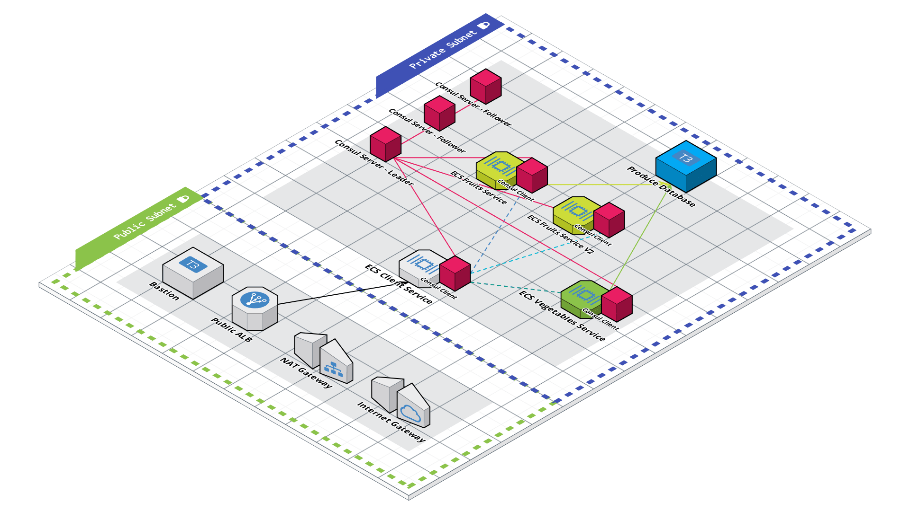
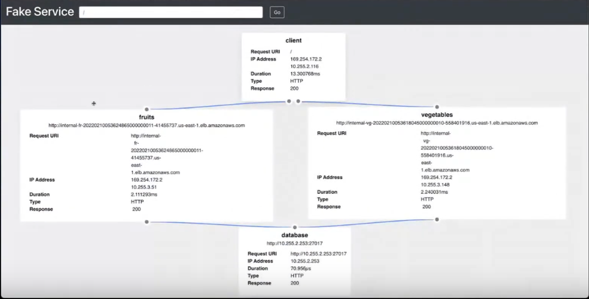
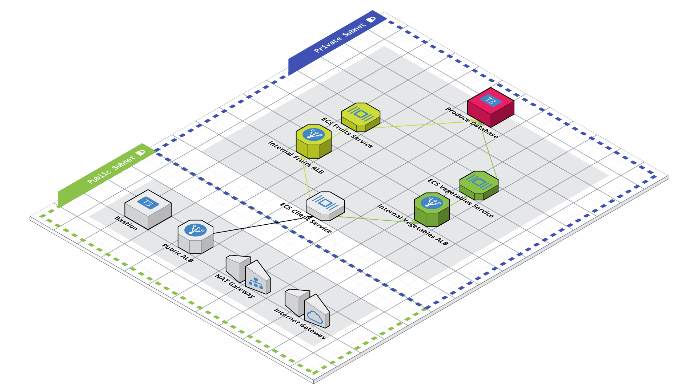
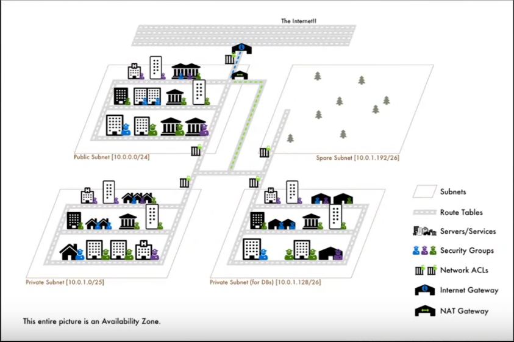
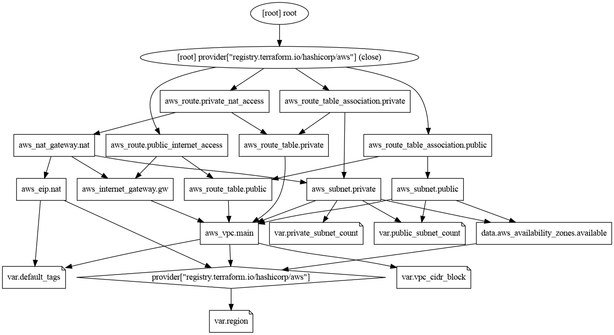

# Building Microservices with AWS and HashiCorp

# Laying the Foundations of a Microservices Architecture

These notes cover the [episodes of a series](https://www.youtube.com/playlist?list=PL81sUbsFNc5bXfbscI9dYj0p3cvagLqFn) on building a microservices architecture using AWS and HashiCorp’s Terraform. The focus is on establishing the groundwork, from setting up a Terraform project to provisioning a Virtual Private Cloud (VPC) and ECS for containerized services on AWS. We'll also have to configure the ALB and private subnets and connect services to the database among other things. Later on, we'll refactor what we have to include a service mesh with Consul. In the end, we ought to have a microservices like the one shown below:



## Microservices and Service Mesh Architecture Overview

This section introduces the rationale for microservices architecture and the tools used to build it while also discussing the role of a service mesh.

### Purpose of Microservices

Microservices split an application into small, independent services, each handling a specific function. This enables teams to work on separate services without affecting the entire system, improving agility and scalability. The architecture in this series includes a client service, exposed via an Application Load Balancer (ALB), connecting to backend services (fruits and vegetables) and a database, all within a private network.

Each service (e.g., fruits, vegetables) handles a specific task, reducing dependencies compared to a monorepo. This supports large teams and multi-region deployments.

### Service Mesh Role

A service mesh, like Consul, standardizes service-to-service communication, authentication, and security. It eliminates the need for individual load balancers and firewall rules per service, simplifying scalability. The series will first build without a mesh, then refactor to demonstrate Consul’s benefits.

### Tools: Terraform and AWS

Terraform, a configuration language (HCL), defines and provisions infrastructure as code. AWS provides the cloud environment, with services like ECS (Elastic Container Service) for running containers. Together, they enable repeatable, version-controlled infrastructure setup. The demo uses a fake service to simulate backend services, focusing on infrastructure rather than application code.

### Architecture Design

The planned architecture consists of:

- **Client Service:** This is the entry point, exposed publicly via an application load balancer. It’s not just a front-end UI but a service that aggregates data from backend services (like fruits and vegetables) and presents it to users or APIs.
- **Backend Services:** Fruits and vegetables are example services running in private subnets, talking to a database. We’re using a tool called [fake service](https://github.com/nicholasjackson/fake-service) to mock these services, so we can focus on infrastructure rather than writing app code.

  

- **Database:** The “grocery” database stores data for all services. It’s private and only accessible by the services.

The initial build avoids a service mesh, but a future refactor will incorporate HashiCorp’s Consul to simplify service communication.



## Terraform Fundamentals

This section covers the basics of setting up and using Terraform to manage AWS resources.

### Project Structure

A Terraform project is a directory containing `.tf` files that define resources. Terraform processes all files in the directory, regardless of naming or order, offering flexibility in organization. The project starts with a `main.tf` file, later splitting resources into separate files for clarity.

### Providers

Providers connect Terraform to external platforms like AWS. The AWS provider allows creation of AWS resources. Other providers, like TLS or random, can be used for tasks such as generating keys or UUIDs.

```py
# File: main.tf
terraform {
  required_providers {
    aws = {
      source  = "hashicorp/aws"
      version = "~> 4.0"
    }
  }
}

provider "aws" {
  region = var.region
}
```

- `required_providers`: Specifies the AWS provider and version.
- `provider "aws"`: Configures the provider, setting the region via a variable.

### Workflow

Terraform’s workflow involves three steps:

1. **Write**: Define resources in `.tf` files.
2. **Plan**: Run `terraform plan` to preview changes.
3. **Apply**: Run `terraform apply` to create or update resources in AWS.

The `terraform init` command initializes the project, downloading providers. The AWS CLI, configured with credentials, enables Terraform to make API calls to AWS.

### Creating a VPC

The first resource is a VPC, a private network for hosting services. The initial setup defines a VPC with a hardcoded CIDR block:

```py
# File: main.tf
resource "aws_vpc" "example" {
  cidr_block = "10.0.0.0/16"
}
```

Running `terraform init`, `plan`, and `apply` creates the VPC, visible in the AWS Console. The `/16` CIDR provides a large IP range, later adjusted for a smaller scope.

## Enhancing Reusability

To make the code flexible and maintainable, variables and file organization are introduced.

### Input Variables

Variables allow configuration without hardcoding values. A `variables.tf` file defines inputs for the region and VPC CIDR block:

```py
# File: variables.tf
variable "region" {
  type        = string
  description = "AWS region for the infrastructure"
  default     = "us-east-1"
}

variable "vpc_cidr_block" {
  type        = string
  description = "CIDR block for the VPC"
  default     = "10.255.0.0/20"
}
```

The `main.tf` file references these variables:

```py
# File: main.tf
provider "aws" {
  region = var.region
}

resource "aws_vpc" "main" {
  cidr_block = var.vpc_cidr_block
}
```

- `var.<variable_name>` references the variable.
- The `/20` CIDR reduces the IP range for a smaller VPC.
- Defaults prevent repetitive input during `terraform apply`.

### File Organization

The VPC resource is moved to a `vpc.tf` file for better organization:

```py
# File: vpc.tf
resource "aws_vpc" "main" {
  cidr_block = var.vpc_cidr_block
}
```

Terraform automatically processes all `.tf` files, building a dependency graph to manage resource relationships. Terraform ignores subdirectories unless used for modules. Typically for larger project when the flat structure becomes unwieldy, modularization is preferable.

### Default Tags

Default tags ensure consistent metadata across resources. A map variable defines tags:

```py
# File: variables.tf
variable "default_tags" {
  type        = map(string)
  description = "Default tags for all resources"
  default     = {
    project = "learning-live-with-aws-hashicorp"
  }
}
```

The `main.tf` file applies these tags to all resources:

```py
# File: main.tf
provider "aws" {
  region = var.region
  default_tags {
    tags = var.default_tags
  }
}
```

Running `terraform apply` adds the `project` tag to the VPC, visible in the AWS Console.

## Virtual Private Cloud (VPC) Overview

A Virtual Private Cloud (VPC) is a private network within the AWS cloud, isolating resources from other networks and the internet.

### Key Components

- **IP Address Range (CIDR Block)**: Defines the range of IP addresses for resources within the VPC.
- **Subnets**: Segments of the VPC's IP range, divided into public and private subnets.
- **Internet Gateway**: Enables internet access for resources in public subnets.
- **Network Address Translation (NAT) Gateway**: Allows private subnet resources to access the internet for updates or package installations.
- **Route Tables**: Direct traffic between resources, subnets, and the internet.
- **Security Groups and Network Access Control Lists (ACLs)**: Provide security layers to control access to resources.

### City Analogy

The diagram below provides a visual representation of a VPC using a city analogy:



- **VPC**: Represents a city, with the CIDR block as the range of postal codes.
- **Subnets**: Individual blocks within the city.
- **Route Tables**: Roads directing traffic within the city.
- **Internet Gateway**: An on-ramp to the internet.
- **NAT Gateway**: An on-ramp for private subnets to access the internet.
- **Services**: Buildings within the city.
- **Security Groups**: Security guards at buildings.
- **Network ACLs**: Gates controlling access to city blocks.

### Workflow for Building a VPC in Terraform

The process mirrors the AWS Management Console workflow, using Terraform documentation to map console inputs to Terraform arguments.

#### Steps

1. **Start with the AWS Console**: Identify required fields for creating a VPC (e.g., name tag, IPv4 CIDR block, tenancy).
2. **Map to Terraform Docs**: Locate the `aws_vpc` resource in the Terraform AWS provider documentation and use the argument reference to fill in required fields.
3. **Add Additional Fields**: Include settings like DNS support and hostnames, not always prompted in the console but critical for functionality.

#### Example: Creating a VPC

The following Terraform code sets up a VPC with a name tag, IPv4 and IPv6 CIDR blocks, default tenancy, and DNS settings.

```py
# File: main.tf

resource "aws_vpc" "main" {
  cidr_block           = "10.255.0.0/20"
  assign_generated_ipv6_cidr_block = true
  instance_tenancy     = "default"
  enable_dns_support   = true
  enable_dns_hostnames = true

  tags = {
    Name = "${var.default_tags.project}-vpc"
  }
}
```

### Creating Subnets

Subnets divide the VPC’s IP range into smaller segments, categorized as public or private.

#### Public Subnet Configuration

- **Purpose**: Hosts resources accessible from the internet.
- **Key Settings**:
  - Associate with the VPC using `vpc_id`.
  - Define a smaller CIDR block using the `cidrsubnet` function.
  - Enable public IP and IPv6 address assignment on resource launch.
  - Specify an availability zone for high availability.

**Using the `cidrsubnet` Function**

The `cidrsubnet` function carves out a smaller CIDR block from the VPC’s CIDR block:

- **Syntax**: `cidrsubnet(cidr_block, newbits, netnum)`
  - `cidr_block`: The VPC’s CIDR block (e.g., `10.255.0.0/20`).
  - `newbits`: Additional bits for the subnet mask (e.g., `4` to create a `/24` subnet).
  - `netnum`: Identifies the subnet (e.g., `0` for the first subnet).

#### Example: Public Subnet

```py
# File: main.tf

resource "aws_subnet" "public" {
  vpc_id                  = aws_vpc.main.id
  cidr_block              = cidrsubnet(aws_vpc.main.cidr_block, 4, 0) 
  ipv6_cidr_block         = cidrsubnet(aws_vpc.main.ipv6_cidr_block, 8, 0)
  map_public_ip_on_launch = true
  assign_ipv6_address_on_creation = true
  availability_zone       = data.aws_availability_zones.available.names[0]

  tags = {
    Name = "${var.default_tags.project}-public-${
              data.aws_availability_zones.available.names[0]}"
  }
}
```

### Using Data Sources

Data sources query AWS for information, such as available availability zones, to make configurations dynamic.

#### Example: Querying Availability Zones

```py
# File: data.tf

data "aws_availability_zones" "available" {
  state = "available"
}
```

This data source retrieves a list of available availability zones in the current region, used in the subnet configuration to assign an availability zone dynamically.

### Route Tables and Routes

Route tables direct traffic within the VPC and to external networks.

#### Route Table Configuration

- Associate with the VPC using `vpc_id`.
- Add a name tag for console visibility.

#### Route Configuration

- Associate with a route table using `route_table_id`.
- Specify a destination CIDR block (e.g., `0.0.0.0/0` for all traffic).
- Point to an internet gateway using `gateway_id`.

#### Route Table Association

- Links a subnet to a route table to apply routing rules.

#### Example: Route Table, Route, and Association

```py
# File: main.tf

resource "aws_route_table" "public" {
  vpc_id = aws_vpc.main.id

  tags = {
    Name = "${var.default_tags.project}-public"
  }
}

resource "aws_route" "public_internet_access" {
  route_table_id         = aws_route_table.public.id
  destination_cidr_block = "0.0.0.0/0"
  gateway_id             = aws_internet_gateway.main.id
}

resource "aws_route_table_association" "public" {
  subnet_id      = aws_subnet.public.id
  route_table_id = aws_route_table.public.id
}
```

### Internet Gateway

An internet gateway enables public subnets to access the internet.

#### Configuration

- Attach to the VPC using `vpc_id`.
- Add a name tag for identification.

#### Example: Internet Gateway

```py
# File: main.tf

resource "aws_internet_gateway" "main" {
  vpc_id = aws_vpc.main.id

  tags = {
    Name = "${var.default_tags.project}-igw"
  }
}
```

**Terraform Dependency Management**

Terraform automatically manages resource dependencies, creating resources in the correct order based on references (e.g., `aws_vpc.main.id`). Explicit dependency control is possible using the `depends_on` attribute, covered in later sections.

## Scaling Subnets for Microservices

To support a microservices architecture, a VPC needs multiple subnets to distribute workloads across availability zones (AZs) for resilience and scalability. This section explores how to efficiently create multiple public and private subnets, ensuring no overlap in IP ranges and proper routing for internet access.

### Why Multiple Subnets?

Microservices often require separation between public-facing components (e.g., API gateways, load balancers) and private components (e.g., databases, backend services). Public subnets allow direct internet access, while private subnets enhance security by restricting inbound traffic. Spreading subnets across AZs ensures high availability, as a failure in one zone doesn’t disrupt the entire application. Before scaling, it’s critical to validate a single-subnet configuration to ensure the VPC, route tables, and internet gateways function correctly.

### Single Subnet as a Foundation

Before introducing dynamic replication, consider a single public subnet. This establishes the baseline configuration, including CIDR block allocation and route table association. For example:

```py
# File: vpc.tf (single subnet example)

resource "aws_subnet" "public" {
  vpc_id                          = aws_vpc.main.id
  cidr_block                      = cidrsubnet(aws_vpc.main.cidr_block, 4, 0) 
  ipv6_cidr_block                 = cidrsubnet(aws_vpc.main.ipv6_cidr_block, 8, 0)
  map_public_ip_on_launch         = true
  assign_ipv6_address_on_creation = true
  availability_zone               = data.aws_availability_zones.available.names[0]
  tags = {
    Name = "${var.default_tags.project}-public-${
    data.aws_availability_zones.available.names[0]}"
  }
}
```

Here, the `cidrsubnet` function calculates a subnet range from the VPC’s CIDR (e.g., 10.255.0.0/20). It takes three arguments:

- **prefix**: The VPC’s CIDR block (e.g., 10.255.0.0/20).
- **newbits**: Additional bits for the subnet mask (e.g., 4 extends /20 to /24, yielding 256 addresses per subnet).
- **netnum**: The subnet number (e.g., 0 for the first subnet).

The function shifts the base address to create non-overlapping ranges (e.g., 10.255.0.0/24 for netnum=0, 10.255.1.0/24 for netnum=1). `map_public_ip_on_launch` assigns public IPs to resources, enabling internet access.

### Introducing the `count` Meta-Argument

Manually duplicating subnet resources for each AZ is verbose and error-prone. Terraform’s `count` meta-argument allows creating multiple instances of a resource dynamically. It’s a top-level attribute applied to any resource, specifying how many copies to create. The `count.index` variable (starting at 0) differentiates each instance, enabling unique configurations like CIDR blocks and AZ assignments.

#### Prerequisites for Using `count`

Before applying `count`, ensure the single-subnet configuration works (`terraform apply` succeeds). This confirms the VPC, data sources (e.g., availability zones), and dependencies are correct. Define a variable to control the number of subnets, making the configuration reusable.

```py
# File: variables.tf

variable "public_subnet_count" {
  type        = number
  description = "Number of public subnets to create"
  default     = 2
}
```

#### Applying `count` to Public Subnets

Update the public subnet resource to use `count`, varying CIDR blocks and AZs with `count.index`. This spreads subnets across AZs for fault tolerance.

```py
# File: vpc.tf

resource "aws_subnet" "public" {
  count                           = var.public_subnet_count
  vpc_id                          = aws_vpc.main.id
  cidr_block          = cidrsubnet(aws_vpc.main.cidr_block, 4, count.index)
  ipv6_cidr_block     = cidrsubnet(aws_vpc.main.ipv6_cidr_block, 8, count.index)
  map_public_ip_on_launch         = true
  assign_ipv6_address_on_creation = true
  availability_zone   = data.aws_availability_zones.available.names[count.index]
  tags = {
    Name = "${var.default_tags.project}-public-${
    data.aws_availability_zones.available.names[count.index]}"
  }
}
```

Here, `count.index` replaces the fixed `0` in `cidrsubnet` and `availability_zone`, creating subnets like 10.255.0.0/24 (index=0) and 10.255.1.0/24 (index=1), each in a different AZ. However, the tag’s `names[0]` is incorrect—it should use `count.index` to reflect the correct AZ:

```py
tags = {
  Name = "${var.default_tags.project}-public-${
  data.aws_availability_zones.available.names[count.index]}"
}
```

#### Dynamic Route Table Associations

Each subnet needs a route table association. Using `count` here ensures each subnet links to the public route table. The challenge is referencing individual subnet IDs from the list of public subnets created with `count`.

##### The Splat Operator and `element` Function

The splat operator (`*`) accesses all instances of a resource’s attribute as a list (e.g., `aws_subnet.public.*.id` returns a list of all public subnet IDs). Since `subnet_id` expects a single ID, the `element` function selects one item: `element(list, index)`. It wraps around if the index exceeds the list length, but care is needed to avoid exceeding available AZs (e.g., us-east-1 typically has 6 AZs).

```py
# File: vpc.tf

resource "aws_route_table_association" "public" {
  count          = var.public_subnet_count
  subnet_id      = element(aws_subnet.public.*.id, count.index)
  route_table_id = aws_route_table.public.id
}
```

This creates one association per subnet, matching each subnet’s ID to the route table.

## Configuring Private Subnets

Private subnets host sensitive microservices, like backend APIs or databases, without direct internet exposure. They differ from public subnets in key ways:

- **No Public IPs**: Omit `map_public_ip_on_launch` and `assign_ipv6_address_on_creation` to prevent external access, enhancing security.
- **CIDR Offset**: Avoid overlap with public subnets by offsetting the `netnum` in `cidrsubnet`.

### Variable for Private Subnets

Define a variable to control the number of private subnets.

```py
# File: variables.tf

variable "private_subnet_count" {
  type        = number
  description = "Number of private subnets to create"
  default     = 2
}
```

### Private Subnet Configuration

Offset the CIDR block by the number of public subnets to ensure unique ranges. For example, if public subnets use 10.255.0.0/24 and 10.255.1.0/24, private subnets start at 10.255.2.0/24.

```py
# File: vpc.tf

resource "aws_subnet" "private" {
  count             = var.private_subnet_count
  vpc_id            = aws_vpc.main.id
  cidr_block        = cidrsubnet(aws_vpc.main.cidr_block, 4, 
                                count.index + var.public_subnet_count)
  availability_zone = data.aws_availability_zones.available.names[count.index]
  tags = {
    Name = "${var.default_tags.project}-private-${
    data.aws_availability_zones.available.names[count.index]}"
  }
}
```

The `count.index + var.public_subnet_count` ensures the first private subnet starts after the last public subnet (e.g., index=0 + public_subnet_count=2 gives netnum=2, yielding 10.255.2.0/24). The tag should also use `count.index` for correct AZ naming, correcting the provided code’s error.

### Why Offset CIDR Blocks?

Without offsetting, private subnets would attempt to reuse public subnet CIDR ranges, causing conflicts (e.g., both trying to use 10.255.0.0/24). Using `var.public_subnet_count` ensures that even if public and private subnet counts differ (e.g., 3 public, 1 private), the private subnet starts at 10.255.3.0/24, avoiding overlap.

### Enabling Internet Access for Private Subnets

Private subnets need outbound internet access for tasks like software updates, achieved via a NAT gateway in a public subnet, which requires an Elastic IP (EIP).

#### Elastic IP (EIP)

An EIP is a static public IP address, necessary for the NAT gateway to maintain a consistent external address.

```py
# File: vpc.tf

resource "aws_eip" "nat" {
  domain = "vpc"
  tags = {
    Name = "${var.default_tags.project}-nat-eip"
  }
}
```

The `domain = "vpc"` ties the EIP to the VPC, ensuring it’s usable for networking resources like NAT gateways.

#### NAT Gateway

The NAT gateway translates private subnet traffic to the public internet, residing in a public subnet to access the internet gateway. It’s single-AZ by default, so for high availability, create one per AZ (not covered here but noted for scalability).

```py
# File: vpc.tf

resource "aws_nat_gateway" "nat" {
  allocation_id = aws_eip.nat.id
  subnet_id     = aws_subnet.public[0].id  # First public subnet
  tags = {
    Name = "${var.default_tags.project}-nat-gateway"
  }
  depends_on = [aws_eip.nat, aws_internet_gateway.gw]
}
```

The `subnet_id` uses array notation (`[0]`) instead of the splat operator to select the first public subnet explicitly, as only one NAT gateway is created here.

**Explicit Dependencies with `depends_on`**

Terraform infers dependencies from references (e.g., `aws_eip.nat.id`), but `depends_on` ensures the EIP and internet gateway exist before the NAT gateway. This prevents race conditions, especially since NAT gateways rely on both resources.

```py
depends_on = [aws_eip.nat, aws_internet_gateway.gw]
```

### Private Route Table and Routing

Direct private subnet traffic to the NAT gateway for outbound access.

```py
# File: vpc.tf

resource "aws_route_table" "private" {
  vpc_id = aws_vpc.main.id
  tags = {
    Name = "${var.default_tags.project}-private-route-table"
  }
}

resource "aws_route" "private_nat_access" {
  route_table_id         = aws_route_table.private.id
  destination_cidr_block = "0.0.0.0/0"
  nat_gateway_id         = aws_nat_gateway.nat.id
}

resource "aws_route_table_association" "private" {
  count          = var.private_subnet_count
  subnet_id      = element(aws_subnet.private.*.id, count.index)
  route_table_id = aws_route_table.private.id
}
```

The route uses `nat_gateway_id` instead of `gateway_id` (used for internet gateways), directing all outbound traffic (`0.0.0.0/0`) to the NAT gateway. The association uses `count` and `element` to link each private subnet to the route table.

## Terraform Workflow Enhancements

### Code Formatting

The `terraform fmt` command aligns code (e.g., equal signs, spacing) for readability, making it easier to scan large configurations.

### Visualizing Resource Relationships

The `terraform graph` command outputs a dependency graph, convertible to a PNG for visual analysis.

```bash
terraform graph -type=plan | dot -Tpng >images/vpc-configurations.png
```

This visualizes how resources like subnets, route tables, and gateways interrelate (as shown below), aiding debugging and planning.



### Cleaning Up Resources

To avoid costs, destroy resources when not needed using `terraform destroy`. Since the configuration is in code, resources can be recreated identically later.

This setup provides a robust VPC foundation for microservices, with public subnets for accessible components and private subnets for secure ones, all scalable and manageable through Terraform’s declarative approach.
